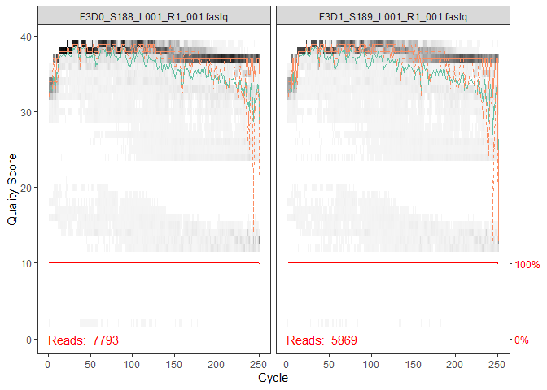
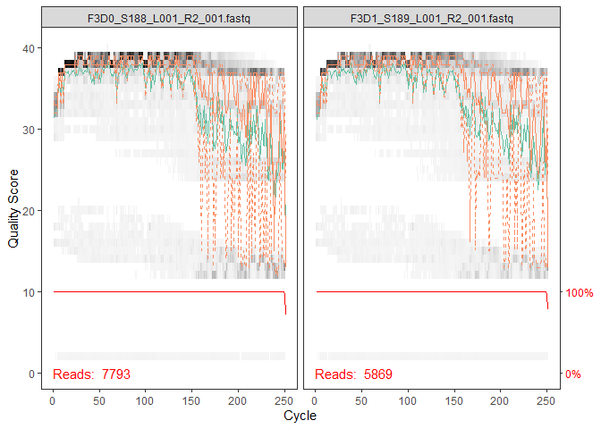
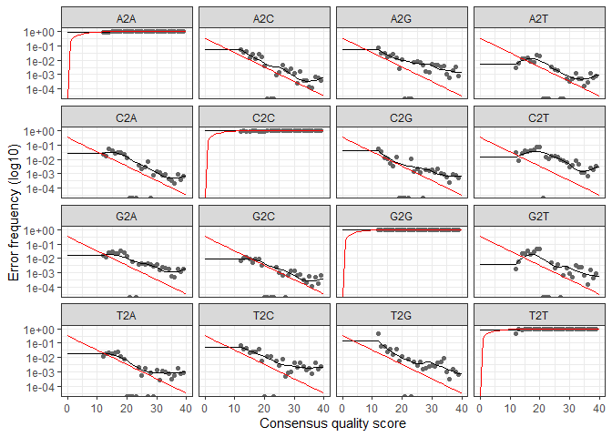

### DADA2 is a method of converting 16S amplicon sequence data into ASV tables and this workflow shows how to carry out the necessary analysis steps.

#### Important resources:

-   The [DADA2 website](https://benjjneb.github.io)
-   The [DADA2 tutorial
    workflow](https://benjjneb.github.io/dada2/tutorial.html)
-   The [DADA2 Issues forum](https://github.com/benjjneb/dada2/issues)

The DADA2 Workflow
------------------

1.  Preprocessing
2.  Filter and Trim
3.  Learn Error Rates
4.  Denoise/Sample Inference
5.  Merge (if paired-end)
6.  Remove Chimeras
7.  Assign Taxonomy

**This workflow assumes that your sequencing data meets certain
criteria:**

-   Samples have been demultiplexed, i.e. split into individual
    per-sample fastq files.
-   Non-biological nucleotides have been removed, e.g. primers,
    adapters, linkers, etc.
-   If paired-end sequencing data, the forward and reverse fastq files
    contain reads in matched order.

See [the DADA2 FAQ](https://benjjneb.github.io/dada2/faq.html) for tips
to deal with non-demultiplexed files and primer removal.

Load package and set path
-------------------------

    library(BiocManager)
    # To install dada2 bioconductor R package
    # BiocManager::install('dada2')
    library(dada2); packageVersion("dada2")

    ## [1] '1.14.0'

    library(dada2)
    library(Rcpp)
    library(knitr)
    library(tidyverse)
    require(knitcitations)
    library(ggplot2); packageVersion("ggplot2")

    ## [1] '3.2.1'

Set the path to the fastq files, it is better to be in the same folder
with your dada2.R file. The experimental data is from [DADA2
tutorial](https://benjjneb.github.io/dada2/tutorial.html).

    path <- "data"  # you can download it as zip folder named 'MiSeqSOPData'
    head(list.files(path))

    ## [1] "F3D0_S188_L001_R1_001.fastq" "F3D0_S188_L001_R2_001.fastq" "F3D1_S189_L001_R1_001.fastq"
    ## [4] "F3D1_S189_L001_R2_001.fastq" "filtered"

### Forward and reverse fastq filenames have format: SAMPLENAME\_R1.fastq.gz and SAMPLENAME\_R2.fastq.gz

Get matched lists of the forward and reverse fastq.gz files: \#\#\#\#\#
We have just four fasteq files, two per one sample

    # Forward and reverse fastq filenames have format: SAMPLENAME_R1.fastq.gz and SAMPLENAME_R2.fastq.gz
    fnFs <- sort(list.files(path, pattern="_R1_001.fastq", full.names = TRUE))
    fnRs <- sort(list.files(path, pattern="_R2_001.fastq", full.names = TRUE))
    fnFs[[1]]; fnRs[[1]]

    ## [1] "data/F3D0_S188_L001_R1_001.fastq"

    ## [1] "data/F3D0_S188_L001_R2_001.fastq"

    fnFs[[2]]; fnRs[[2]]

    ## [1] "data/F3D1_S189_L001_R1_001.fastq"

    ## [1] "data/F3D1_S189_L001_R2_001.fastq"

Extract sample names, assuming filenames have format:
SAMPLENAME\_XXX.fastq.gz

    sample.names <- sapply(strsplit(basename(fnFs), "_"), `[`, 1)
    head(sample.names)

    ## [1] "F3D0" "F3D1"

Check the amplicon design
-------------------------

Forward quality profiles: Truncate where?
-----------------------------------------

    p<-plotQualityProfile(fnFs[1:2]) #for two samples

    ## Scale for 'y' is already present. Adding another scale for 'y', which will replace the
    ## existing scale.

    print(p)

Reverse quality profiles: Truncate where?
-----------------------------------------

    p<-plotQualityProfile(fnRs[1:2])

    ## Scale for 'y' is already present. Adding another scale for 'y', which will replace the
    ## existing scale.

    print(p)

Filter and trim
---------------

Assign filenames for the filtered fastq.gz in the filtered/
subdirectory.

    filtFs <- file.path(path, "filtered", paste0(sample.names, "_F_filt.fastq.gz"))
    filtRs <- file.path(path, "filtered", paste0(sample.names, "_R_filt.fastq.gz"))
    names(filtFs) <- sample.names
    names(filtRs) <- sample.names

The critical parameters we chose are the truncation lengths of **240**
(forward) and **170** (reverse).

    out <- filterAndTrim(fnFs, filtFs, fnRs, filtRs, 
                         truncLen=c(240,170), maxEE=c(2,2), # maxEE=2 is the default
                         compress=TRUE, multithread=T) # Set multithread=TRUE to use all cores

In most cases, the key quality filtering parameter is `maxEE`, which
sets the maximum number of expected errors allowed in each read. This
has been shown to be a better quality filter than an average quality
score filter.

Quality filtering options
-------------------------

-   `maxEE`: Maximum expected errors, usually the only quality filter
    needed.
-   `truncQ`: Truncate at first occurrence of this quality score.
-   `maxLen`: Remove sequences greater than this length (mostly for
    pyrosequencing).
-   `minLen`: Remove sequences less than this length.
-   `maxN`: Remove sequences with more than this many Ns. `dada2`
    requires no Ns, so `maxN=0` by default.
-   `rm.lowcomplex`: Remove reads with complexity less than this value.

Usually `maxEE` is enough, but for non-Illumina sequencing technologies,
or less standard setups, the other options can be useful as well.
Remember that help is your friend! `?filterAndTrim`

SANITY CHECK: Filtering Stats
-----------------------------

    head(out)

    ##                             reads.in reads.out
    ## F3D0_S188_L001_R1_001.fastq     7793      7092
    ## F3D1_S189_L001_R1_001.fastq     5869      5282

Primer removal
--------------

For common primer designs, in which a primer of fixed length is at the
start of the forward (and reverse) reads, primers can be removed by
dada2 in the `filterAndTrim` step.

    # Single-end reads
    filterAndTrim(..., trimLeft=FWD_PRIMER_LENGTH)
    # Paired-end reads
    filterAndTrim(..., trimLeft=c(FWD_PRIMER_LENGTH, REV_PRIMER_LENGTH))

However! There are other scenarios that this won’t handle, in particular
when amplicon length is too so variable that reads sometime read into
the other primer at the end: With highly variable amlicons, you will
need to use an outside program to remove primers prior to running the
dada2 workflow. If you are in that scenario.

Learn the Error Rates
---------------------

    errF <- learnErrors(filtFs, multithread=2) # Set multithread=TRUE to use all cores

    ## 2969760 total bases in 12374 reads from 2 samples will be used for learning the error rates.

    errR <- learnErrors(filtRs, multithread=2)

    ## 2103580 total bases in 12374 reads from 2 samples will be used for learning the error rates.

The DADA2 algorithm makes use of a parametric error model (`err`) and
every amplicon dataset has a different set of error rates. The
`learnErrors` method learns this error model from the data, by
alternating estimation of the error rates and inference of sample
composition until they converge on a jointly consistent solution.

SANITY CHECK: Error Rates
-------------------------

    p<-plotErrors(errF, nominalQ=TRUE)
    print(p)

SANITY CHECK: Error Rates
-------------------------

-   Does the model (black line) reasonably fit the observations (black
    points)?
    -   Do the error rates mostly decrease with quality score?

    The goal here is good, not perfect, so don’t sweat the small stuff
    (or non-convergence).

Dereplicate
-----------

Dereplication combines all identical sequencing reads into “unique
sequences” with a corresponding “abundance” equal to the number of reads
with that unique sequence.

    derepFs <- derepFastq(filtFs)
    derepRs <- derepFastq(filtRs)
    # Name the derep-class objects by the sample names
    names(derepFs) <- sample.names
    names(derepRs) <- sample.names

**Big Data**: The tutorial dataset is small enough to easily load into
memory. If your dataset exceeds available RAM, it is preferable to
process samples one-by-one in a streaming fashion: see the [DADA2
Workflow on Big Data](bigdata.html) for an example.

Sample Inference
----------------

We are now ready to apply [the core sample inference
algorithm](https://www.nature.com/articles/nmeth.3869#methods) to the
dereplicated data.

    dadaFs <- dada(derepFs, err=errF, multithread=2) # Set multithread=TRUE to use all cores

    ## Sample 1 - 7092 reads in 1969 unique sequences.
    ## Sample 2 - 5282 reads in 1629 unique sequences.

    dadaRs <- dada(derepRs, err=errR, multithread=2)

Inspect the `dada-class` object
-------------------------------

    dadaFs[[1]]

    ## dada-class: object describing DADA2 denoising results
    ## 128 sequence variants were inferred from 1969 input unique sequences.
    ## Key parameters: OMEGA_A = 1e-40, OMEGA_C = 1e-40, BAND_SIZE = 16

    dadaRs[[1]]

    ## dada-class: object describing DADA2 denoising results
    ## 123 sequence variants were inferred from 1942 input unique sequences.
    ## Key parameters: OMEGA_A = 1e-40, OMEGA_C = 1e-40, BAND_SIZE = 16

The `getSequences` and `getUniques` functions work on just about any
dada2-created object. `getUniques` returns an integer vector, named by
the sequences and valued by their abundances. `getSequences` just
returns the sequences.

    head(getSequences(dadaFs[[1]]))

    ## [1] "TACGGAGGATGCGAGCGTTATCCGGATTTATTGGGTTTAAAGGGTGCGCAGGCGGAAGATCAAGTCAGCGGTAAAATTGAGAGGCTCAACCTCTTCGAGCCGTTGAAACTGGTTTTCTTGAGTGAGCGAGAAGTATGCGGAATGCGTGGTGTAGCGGTGAAATGCATAGATATCACGCAGAACTCCGATTGCGAAGGCAGCATACCGGCGCTCAACTGACGCTCATGCACGAAAGTGTGG"
    ## [2] "TACGGAGGATGCGAGCGTTATCCGGATTTATTGGGTTTAAAGGGTGCGTAGGCGGCCTGCCAAGTCAGCGGTAAAATTGCGGGGCTCAACCCCGTACAGCCGTTGAAACTGCCGGGCTCGAGTGGGCGAGAAGTATGCGGAATGCGTGGTGTAGCGGTGAAATGCATAGATATCACGCAGAACCCCGATTGCGAAGGCAGCATACCGGCGCCCTACTGACGCTGAGGCACGAAAGTGCGG"
    ## [3] "TACGGAGGATGCGAGCGTTATCCGGATTTATTGGGTTTAAAGGGTGCGTAGGCGGGCTGTTAAGTCAGCGGTCAAATGTCGGGGCTCAACCCCGGCCTGCCGTTGAAACTGGCGGCCTCGAGTGGGCGAGAAGTATGCGGAATGCGTGGTGTAGCGGTGAAATGCATAGATATCACGCAGAACTCCGATTGCGAAGGCAGCATACCGGCGCCCGACTGACGCTGAGGCACGAAAGCGTGG"
    ## [4] "TACGGAGGATGCGAGCGTTATCCGGATTTATTGGGTTTAAAGGGTGCGTAGGCGGGCTTTTAAGTCAGCGGTAAAAATTCGGGGCTCAACCCCGTCCGGCCGTTGAAACTGGGGGCCTTGAGTGGGCGAGAAGAAGGCGGAATGCGTGGTGTAGCGGTGAAATGCATAGATATCACGCAGAACCCCGATTGCGAAGGCAGCCTTCCGGCGCCCTACTGACGCTGAGGCACGAAAGTGCGG"
    ## [5] "TACGGAGGATGCGAGCGTTATCCGGATTTATTGGGTTTAAAGGGTGCGCAGGCGGACTCTCAAGTCAGCGGTCAAATCGCGGGGCTCAACCCCGTTCCGCCGTTGAAACTGGGAGCCTTGAGTGCGCGAGAAGTAGGCGGAATGCGTGGTGTAGCGGTGAAATGCATAGATATCACGCAGAACTCCGATTGCGAAGGCAGCCTACCGGCGCGCAACTGACGCTCATGCACGAAAGCGTGG"
    ## [6] "TACGGAGGATGCGAGCGTTATCCGGATTTATTGGGTTTAAAGGGTGCGTAGGCGGGATGCCAAGTCAGCGGTAAAAAAGCGGTGCTCAACGCCGTCGAGCCGTTGAAACTGGCGTTCTTGAGTGGGCGAGAAGTATGCGGAATGCGTGGTGTAGCGGTGAAATGCATAGATATCACGCAGAACTCCGATTGCGAAGGCAGCATACCGGCGCCCTACTGACGCTGAGGCACGAAAGCGTGG"

DADA2 Options: Multithreading
-----------------------------

All computation-intensive functions in the dada2 R package have optional
multithreading via the `multithread` argument.

-   `multithread = FALSE`: No multithreading. The default.
-   `multithread = TRUE`: Detect the number of available threads, and
    use that many. The fastest.
-   `multithread = N`: Use N threads. A way to be a good citizen on
    shared servers and allow processing for other tasks.

Usually you will want to turn multithreading on!

DADA2 Options: Pooling
----------------------

Pooling can [increase sensitivity to rare per-sample
variants](https://benjjneb.github.io/dada2/pool.html#pooling-for-sample-inference).
`dada(..., pool=TRUE)`

The cost of pooling is increasing memory and computation time
requirements. Pooled sample inference scales quadratically in the number
of samples, while the default independent sample inference scales
linearly.

Pseudo-pooling [approximates pooling in linear
time](https://benjjneb.github.io/dada2/pseudo.html#pseudo-pooling).
`dada(..., pool="pseudo")`

DADA2 Options: Non-Illumnina sequencing technologies
----------------------------------------------------

For pyrosequencing data (e.g. **454 or Ion Torrent**) we recommend a
slight change in the alignment parameters to better handle those
technologies tendency to make homopolymer errors.

    foo <- dada(..., HOMOPOLYMER_GAP_PENALTY=-1, BAND_SIZE=32)

DADA2 Options: Sensitivity
--------------------------

Sensitivity options

-   `OMEGA_A`: The key sensititivy parameters, controls the p-value
    threshold at which to call new ASVs.
-   `OMEGA_C`: The error-correction threshold. One alternative is to
    turn off error-correction.
-   `MIN_ABUNDANCE`: Sets a minimum abundance threshold to call new
    ASVs.
-   `MIN_FOLD`: Minimum fold overabundance relative to error model for
    new ASVs.

**See also the `priors` argument to raise sensitivity (at no cost to
specificity) for sequences you expect might be present.**

Merge, Table, Remove Chimeras, Sanity Check
-------------------------------------------

Merge Paired Reads
------------------

    library(dada2)

    mergers<- dada2::mergePairs(dadaFs, derepFs, dadaRs, derepRs, verbose = T)

**Most reads should pass the merging step! If that isn’t the case, are
you sure your truncated reads still overlap sufficiently?**

-   If (a): Use normally.
-   If (b or a+b): `mergePairs(..., trimOverhang=TRUE)` *(but you
    probably should have trimmed away the overhang earlier, see ITS
    workflow)*
    -   If (c): `mergePairs(..., justConcatenate=TRUE)`.
-   If (a+c or a+b+c): Trouble.

Construct Sequence Table (ASV Table)
------------------------------------

    seqtab <- makeSequenceTable(mergers)

The sequence table is a `matrix` with rows corresponding to (and named
by) the samples, and columns corresponding to (and named by) the
sequence variants.

    dim(seqtab)

    ## [1]   2 128

Inspect distribution of sequence lengths

    table(nchar(getSequences(seqtab)))

    ## 
    ## 251 252 253 254 255 
    ##   1  21 101   4   1

The lengths of the merged sequences all fall in the expected range for
this amplicon.

Remove chimeras
---------------

Chimeric sequences are identified if they can be exactly reconstructed
by combining a left-segment and a right-segment from two more abundant
“parent” sequences.

    seqtab.nochim <- removeBimeraDenovo(seqtab, method="consensus", multithread=2, verbose=TRUE)
    # Set multithread=TRUE to use all cores
    sum(seqtab.nochim)/sum(seqtab)

    ## [1] 0.9979644

**In some cases, most sequences will be chimeric. But most reads should
not be. If they are, you probably have unremoved primers.**

If you used `pool=TRUE` during sample inference, you should use
`method="pooled"` for chimera removal.

Track reads through the pipeline
--------------------------------

Look at the number of reads that made it through each step in the
pipeline:

    getN <- function(x) sum(getUniques(x))
    track <- cbind(out, sapply(dadaFs, getN), sapply(dadaRs, getN), sapply(mergers, getN), rowSums(seqtab.nochim))
    colnames(track) <- c("input", "filtered", "denoisedF", "denoisedR", "merged", "nonchim")
    rownames(track) <- sample.names
    head(track)

    ##      input filtered denoisedF denoisedR merged nonchim
    ## F3D0  7793     7092      6979      6979   6347    6335
    ## F3D1  5869     5282      5211      5213   4952    4941

Looks good! We kept the majority of our raw reads, and there is no
over-large drop associated with any single step.

SANITY CHECK: Read Tracking
---------------------------

    head(track)

    ##      input filtered denoisedF denoisedR merged nonchim
    ## F3D0  7793     7092      6979      6979   6347    6335
    ## F3D1  5869     5282      5211      5213   4952    4941

-   If a majority of reads failed to merge, you may need to revisit
    `truncLen` to ensure overlap.
-   If a majority of reads were removed as chimeric, you may have
    unremoved primers.

**This is the single most important place to inspect your workflow to
make sure everything went as expected!**

\#\# Assign Taxonomy

The `assignTaxonomy` function takes as input a set of sequences to ba
classified, and a training set of reference sequences with known
taxonomy, and outputs taxonomic assignments with at least `minBoot`
bootstrap confidence.

    library(dada2)
    library(Rcpp)
    taxa <- assignTaxonomy(seqtab.nochim, "RefSeq-RDP16S_v2_May2018.fa.gz", multithread=2)
    head(taxa)

    ##                                                                                                                                                                                                                                                               Kingdom   
    ## TACGGAGGATGCGAGCGTTATCCGGATTTATTGGGTTTAAAGGGTGCGCAGGCGGAAGATCAAGTCAGCGGTAAAATTGAGAGGCTCAACCTCTTCGAGCCGTTGAAACTGGTTTTCTTGAGTGAGCGAGAAGTATGCGGAATGCGTGGTGTAGCGGTGAAATGCATAGATATCACGCAGAACTCCGATTGCGAAGGCAGCATACCGGCGCTCAACTGACGCTCATGCACGAAAGTGTGGGTATCGAACAGG  "Bacteria"
    ## TACGGAGGATGCGAGCGTTATCCGGATTTATTGGGTTTAAAGGGTGCGCAGGCGGACTCTCAAGTCAGCGGTCAAATCGCGGGGCTCAACCCCGTTCCGCCGTTGAAACTGGGAGCCTTGAGTGCGCGAGAAGTAGGCGGAATGCGTGGTGTAGCGGTGAAATGCATAGATATCACGCAGAACTCCGATTGCGAAGGCAGCCTACCGGCGCGCAACTGACGCTCATGCACGAAAGCGTGGGTATCGAACAGG  "Bacteria"
    ## TACGGAGGATGCGAGCGTTATCCGGATTTATTGGGTTTAAAGGGTGCGTAGGCGGGCTGTTAAGTCAGCGGTCAAATGTCGGGGCTCAACCCCGGCCTGCCGTTGAAACTGGCGGCCTCGAGTGGGCGAGAAGTATGCGGAATGCGTGGTGTAGCGGTGAAATGCATAGATATCACGCAGAACTCCGATTGCGAAGGCAGCATACCGGCGCCCGACTGACGCTGAGGCACGAAAGCGTGGGTATCGAACAGG  "Bacteria"
    ## TACGGAGGATGCGAGCGTTATCCGGATTTATTGGGTTTAAAGGGTGCGTAGGCGGCCTGCCAAGTCAGCGGTAAAATTGCGGGGCTCAACCCCGTACAGCCGTTGAAACTGCCGGGCTCGAGTGGGCGAGAAGTATGCGGAATGCGTGGTGTAGCGGTGAAATGCATAGATATCACGCAGAACCCCGATTGCGAAGGCAGCATACCGGCGCCCTACTGACGCTGAGGCACGAAAGTGCGGGGATCAAACAGG  "Bacteria"
    ## TACGGAGGATGCGAGCGTTATCCGGATTTATTGGGTTTAAAGGGTGCGTAGGCGGGCTTTTAAGTCAGCGGTAAAAATTCGGGGCTCAACCCCGTCCGGCCGTTGAAACTGGGGGCCTTGAGTGGGCGAGAAGAAGGCGGAATGCGTGGTGTAGCGGTGAAATGCATAGATATCACGCAGAACCCCGATTGCGAAGGCAGCCTTCCGGCGCCCTACTGACGCTGAGGCACGAAAGTGCGGGGATCGAACAGG  "Bacteria"
    ## TACGTAGGGGGCAAGCGTTATCCGGATTTACTGGGTGTAAAGGGAGCGTAGACGGCAGCGCAAGTCTGGAGTGAAATGCCGGGGCCCAACCCCGGAACTGCTTTGGAAACTGTGCAGCTCGAGTGCAGGAGAGGTAAGCGGAATTCCTAGTGTAGCGGTGAAATGCGTAGATATTAGGAGGAACACCAGTGGCGAAGGCGGCTTACTGGACTGTAACTGACGTTGAGGCTCGAAAGCGTGGGGAGCAAACAGG "Bacteria"
    ##                                                                                                                                                                                                                                                               Phylum         
    ## TACGGAGGATGCGAGCGTTATCCGGATTTATTGGGTTTAAAGGGTGCGCAGGCGGAAGATCAAGTCAGCGGTAAAATTGAGAGGCTCAACCTCTTCGAGCCGTTGAAACTGGTTTTCTTGAGTGAGCGAGAAGTATGCGGAATGCGTGGTGTAGCGGTGAAATGCATAGATATCACGCAGAACTCCGATTGCGAAGGCAGCATACCGGCGCTCAACTGACGCTCATGCACGAAAGTGTGGGTATCGAACAGG  "Bacteroidetes"
    ## TACGGAGGATGCGAGCGTTATCCGGATTTATTGGGTTTAAAGGGTGCGCAGGCGGACTCTCAAGTCAGCGGTCAAATCGCGGGGCTCAACCCCGTTCCGCCGTTGAAACTGGGAGCCTTGAGTGCGCGAGAAGTAGGCGGAATGCGTGGTGTAGCGGTGAAATGCATAGATATCACGCAGAACTCCGATTGCGAAGGCAGCCTACCGGCGCGCAACTGACGCTCATGCACGAAAGCGTGGGTATCGAACAGG  "Bacteroidetes"
    ## TACGGAGGATGCGAGCGTTATCCGGATTTATTGGGTTTAAAGGGTGCGTAGGCGGGCTGTTAAGTCAGCGGTCAAATGTCGGGGCTCAACCCCGGCCTGCCGTTGAAACTGGCGGCCTCGAGTGGGCGAGAAGTATGCGGAATGCGTGGTGTAGCGGTGAAATGCATAGATATCACGCAGAACTCCGATTGCGAAGGCAGCATACCGGCGCCCGACTGACGCTGAGGCACGAAAGCGTGGGTATCGAACAGG  "Bacteroidetes"
    ## TACGGAGGATGCGAGCGTTATCCGGATTTATTGGGTTTAAAGGGTGCGTAGGCGGCCTGCCAAGTCAGCGGTAAAATTGCGGGGCTCAACCCCGTACAGCCGTTGAAACTGCCGGGCTCGAGTGGGCGAGAAGTATGCGGAATGCGTGGTGTAGCGGTGAAATGCATAGATATCACGCAGAACCCCGATTGCGAAGGCAGCATACCGGCGCCCTACTGACGCTGAGGCACGAAAGTGCGGGGATCAAACAGG  "Bacteroidetes"
    ## TACGGAGGATGCGAGCGTTATCCGGATTTATTGGGTTTAAAGGGTGCGTAGGCGGGCTTTTAAGTCAGCGGTAAAAATTCGGGGCTCAACCCCGTCCGGCCGTTGAAACTGGGGGCCTTGAGTGGGCGAGAAGAAGGCGGAATGCGTGGTGTAGCGGTGAAATGCATAGATATCACGCAGAACCCCGATTGCGAAGGCAGCCTTCCGGCGCCCTACTGACGCTGAGGCACGAAAGTGCGGGGATCGAACAGG  "Bacteroidetes"
    ## TACGTAGGGGGCAAGCGTTATCCGGATTTACTGGGTGTAAAGGGAGCGTAGACGGCAGCGCAAGTCTGGAGTGAAATGCCGGGGCCCAACCCCGGAACTGCTTTGGAAACTGTGCAGCTCGAGTGCAGGAGAGGTAAGCGGAATTCCTAGTGTAGCGGTGAAATGCGTAGATATTAGGAGGAACACCAGTGGCGAAGGCGGCTTACTGGACTGTAACTGACGTTGAGGCTCGAAAGCGTGGGGAGCAAACAGG "Firmicutes"   
    ##                                                                                                                                                                                                                                                               Class        
    ## TACGGAGGATGCGAGCGTTATCCGGATTTATTGGGTTTAAAGGGTGCGCAGGCGGAAGATCAAGTCAGCGGTAAAATTGAGAGGCTCAACCTCTTCGAGCCGTTGAAACTGGTTTTCTTGAGTGAGCGAGAAGTATGCGGAATGCGTGGTGTAGCGGTGAAATGCATAGATATCACGCAGAACTCCGATTGCGAAGGCAGCATACCGGCGCTCAACTGACGCTCATGCACGAAAGTGTGGGTATCGAACAGG  "Bacteroidia"
    ## TACGGAGGATGCGAGCGTTATCCGGATTTATTGGGTTTAAAGGGTGCGCAGGCGGACTCTCAAGTCAGCGGTCAAATCGCGGGGCTCAACCCCGTTCCGCCGTTGAAACTGGGAGCCTTGAGTGCGCGAGAAGTAGGCGGAATGCGTGGTGTAGCGGTGAAATGCATAGATATCACGCAGAACTCCGATTGCGAAGGCAGCCTACCGGCGCGCAACTGACGCTCATGCACGAAAGCGTGGGTATCGAACAGG  "Bacteroidia"
    ## TACGGAGGATGCGAGCGTTATCCGGATTTATTGGGTTTAAAGGGTGCGTAGGCGGGCTGTTAAGTCAGCGGTCAAATGTCGGGGCTCAACCCCGGCCTGCCGTTGAAACTGGCGGCCTCGAGTGGGCGAGAAGTATGCGGAATGCGTGGTGTAGCGGTGAAATGCATAGATATCACGCAGAACTCCGATTGCGAAGGCAGCATACCGGCGCCCGACTGACGCTGAGGCACGAAAGCGTGGGTATCGAACAGG  "Bacteroidia"
    ## TACGGAGGATGCGAGCGTTATCCGGATTTATTGGGTTTAAAGGGTGCGTAGGCGGCCTGCCAAGTCAGCGGTAAAATTGCGGGGCTCAACCCCGTACAGCCGTTGAAACTGCCGGGCTCGAGTGGGCGAGAAGTATGCGGAATGCGTGGTGTAGCGGTGAAATGCATAGATATCACGCAGAACCCCGATTGCGAAGGCAGCATACCGGCGCCCTACTGACGCTGAGGCACGAAAGTGCGGGGATCAAACAGG  "Bacteroidia"
    ## TACGGAGGATGCGAGCGTTATCCGGATTTATTGGGTTTAAAGGGTGCGTAGGCGGGCTTTTAAGTCAGCGGTAAAAATTCGGGGCTCAACCCCGTCCGGCCGTTGAAACTGGGGGCCTTGAGTGGGCGAGAAGAAGGCGGAATGCGTGGTGTAGCGGTGAAATGCATAGATATCACGCAGAACCCCGATTGCGAAGGCAGCCTTCCGGCGCCCTACTGACGCTGAGGCACGAAAGTGCGGGGATCGAACAGG  "Bacteroidia"
    ## TACGTAGGGGGCAAGCGTTATCCGGATTTACTGGGTGTAAAGGGAGCGTAGACGGCAGCGCAAGTCTGGAGTGAAATGCCGGGGCCCAACCCCGGAACTGCTTTGGAAACTGTGCAGCTCGAGTGCAGGAGAGGTAAGCGGAATTCCTAGTGTAGCGGTGAAATGCGTAGATATTAGGAGGAACACCAGTGGCGAAGGCGGCTTACTGGACTGTAACTGACGTTGAGGCTCGAAAGCGTGGGGAGCAAACAGG "Clostridia" 
    ##                                                                                                                                                                                                                                                               Order          
    ## TACGGAGGATGCGAGCGTTATCCGGATTTATTGGGTTTAAAGGGTGCGCAGGCGGAAGATCAAGTCAGCGGTAAAATTGAGAGGCTCAACCTCTTCGAGCCGTTGAAACTGGTTTTCTTGAGTGAGCGAGAAGTATGCGGAATGCGTGGTGTAGCGGTGAAATGCATAGATATCACGCAGAACTCCGATTGCGAAGGCAGCATACCGGCGCTCAACTGACGCTCATGCACGAAAGTGTGGGTATCGAACAGG  "Bacteroidales"
    ## TACGGAGGATGCGAGCGTTATCCGGATTTATTGGGTTTAAAGGGTGCGCAGGCGGACTCTCAAGTCAGCGGTCAAATCGCGGGGCTCAACCCCGTTCCGCCGTTGAAACTGGGAGCCTTGAGTGCGCGAGAAGTAGGCGGAATGCGTGGTGTAGCGGTGAAATGCATAGATATCACGCAGAACTCCGATTGCGAAGGCAGCCTACCGGCGCGCAACTGACGCTCATGCACGAAAGCGTGGGTATCGAACAGG  "Bacteroidales"
    ## TACGGAGGATGCGAGCGTTATCCGGATTTATTGGGTTTAAAGGGTGCGTAGGCGGGCTGTTAAGTCAGCGGTCAAATGTCGGGGCTCAACCCCGGCCTGCCGTTGAAACTGGCGGCCTCGAGTGGGCGAGAAGTATGCGGAATGCGTGGTGTAGCGGTGAAATGCATAGATATCACGCAGAACTCCGATTGCGAAGGCAGCATACCGGCGCCCGACTGACGCTGAGGCACGAAAGCGTGGGTATCGAACAGG  "Bacteroidales"
    ## TACGGAGGATGCGAGCGTTATCCGGATTTATTGGGTTTAAAGGGTGCGTAGGCGGCCTGCCAAGTCAGCGGTAAAATTGCGGGGCTCAACCCCGTACAGCCGTTGAAACTGCCGGGCTCGAGTGGGCGAGAAGTATGCGGAATGCGTGGTGTAGCGGTGAAATGCATAGATATCACGCAGAACCCCGATTGCGAAGGCAGCATACCGGCGCCCTACTGACGCTGAGGCACGAAAGTGCGGGGATCAAACAGG  "Bacteroidales"
    ## TACGGAGGATGCGAGCGTTATCCGGATTTATTGGGTTTAAAGGGTGCGTAGGCGGGCTTTTAAGTCAGCGGTAAAAATTCGGGGCTCAACCCCGTCCGGCCGTTGAAACTGGGGGCCTTGAGTGGGCGAGAAGAAGGCGGAATGCGTGGTGTAGCGGTGAAATGCATAGATATCACGCAGAACCCCGATTGCGAAGGCAGCCTTCCGGCGCCCTACTGACGCTGAGGCACGAAAGTGCGGGGATCGAACAGG  "Bacteroidales"
    ## TACGTAGGGGGCAAGCGTTATCCGGATTTACTGGGTGTAAAGGGAGCGTAGACGGCAGCGCAAGTCTGGAGTGAAATGCCGGGGCCCAACCCCGGAACTGCTTTGGAAACTGTGCAGCTCGAGTGCAGGAGAGGTAAGCGGAATTCCTAGTGTAGCGGTGAAATGCGTAGATATTAGGAGGAACACCAGTGGCGAAGGCGGCTTACTGGACTGTAACTGACGTTGAGGCTCGAAAGCGTGGGGAGCAAACAGG "Clostridiales"
    ##                                                                                                                                                                                                                                                               Family              
    ## TACGGAGGATGCGAGCGTTATCCGGATTTATTGGGTTTAAAGGGTGCGCAGGCGGAAGATCAAGTCAGCGGTAAAATTGAGAGGCTCAACCTCTTCGAGCCGTTGAAACTGGTTTTCTTGAGTGAGCGAGAAGTATGCGGAATGCGTGGTGTAGCGGTGAAATGCATAGATATCACGCAGAACTCCGATTGCGAAGGCAGCATACCGGCGCTCAACTGACGCTCATGCACGAAAGTGTGGGTATCGAACAGG  "Porphyromonadaceae"
    ## TACGGAGGATGCGAGCGTTATCCGGATTTATTGGGTTTAAAGGGTGCGCAGGCGGACTCTCAAGTCAGCGGTCAAATCGCGGGGCTCAACCCCGTTCCGCCGTTGAAACTGGGAGCCTTGAGTGCGCGAGAAGTAGGCGGAATGCGTGGTGTAGCGGTGAAATGCATAGATATCACGCAGAACTCCGATTGCGAAGGCAGCCTACCGGCGCGCAACTGACGCTCATGCACGAAAGCGTGGGTATCGAACAGG  "Porphyromonadaceae"
    ## TACGGAGGATGCGAGCGTTATCCGGATTTATTGGGTTTAAAGGGTGCGTAGGCGGGCTGTTAAGTCAGCGGTCAAATGTCGGGGCTCAACCCCGGCCTGCCGTTGAAACTGGCGGCCTCGAGTGGGCGAGAAGTATGCGGAATGCGTGGTGTAGCGGTGAAATGCATAGATATCACGCAGAACTCCGATTGCGAAGGCAGCATACCGGCGCCCGACTGACGCTGAGGCACGAAAGCGTGGGTATCGAACAGG  "Porphyromonadaceae"
    ## TACGGAGGATGCGAGCGTTATCCGGATTTATTGGGTTTAAAGGGTGCGTAGGCGGCCTGCCAAGTCAGCGGTAAAATTGCGGGGCTCAACCCCGTACAGCCGTTGAAACTGCCGGGCTCGAGTGGGCGAGAAGTATGCGGAATGCGTGGTGTAGCGGTGAAATGCATAGATATCACGCAGAACCCCGATTGCGAAGGCAGCATACCGGCGCCCTACTGACGCTGAGGCACGAAAGTGCGGGGATCAAACAGG  "Porphyromonadaceae"
    ## TACGGAGGATGCGAGCGTTATCCGGATTTATTGGGTTTAAAGGGTGCGTAGGCGGGCTTTTAAGTCAGCGGTAAAAATTCGGGGCTCAACCCCGTCCGGCCGTTGAAACTGGGGGCCTTGAGTGGGCGAGAAGAAGGCGGAATGCGTGGTGTAGCGGTGAAATGCATAGATATCACGCAGAACCCCGATTGCGAAGGCAGCCTTCCGGCGCCCTACTGACGCTGAGGCACGAAAGTGCGGGGATCGAACAGG  "Porphyromonadaceae"
    ## TACGTAGGGGGCAAGCGTTATCCGGATTTACTGGGTGTAAAGGGAGCGTAGACGGCAGCGCAAGTCTGGAGTGAAATGCCGGGGCCCAACCCCGGAACTGCTTTGGAAACTGTGCAGCTCGAGTGCAGGAGAGGTAAGCGGAATTCCTAGTGTAGCGGTGAAATGCGTAGATATTAGGAGGAACACCAGTGGCGAAGGCGGCTTACTGGACTGTAACTGACGTTGAGGCTCGAAAGCGTGGGGAGCAAACAGG "Lachnospiraceae"   
    ##                                                                                                                                                                                                                                                               Genus             
    ## TACGGAGGATGCGAGCGTTATCCGGATTTATTGGGTTTAAAGGGTGCGCAGGCGGAAGATCAAGTCAGCGGTAAAATTGAGAGGCTCAACCTCTTCGAGCCGTTGAAACTGGTTTTCTTGAGTGAGCGAGAAGTATGCGGAATGCGTGGTGTAGCGGTGAAATGCATAGATATCACGCAGAACTCCGATTGCGAAGGCAGCATACCGGCGCTCAACTGACGCTCATGCACGAAAGTGTGGGTATCGAACAGG  "Barnesiella"     
    ## TACGGAGGATGCGAGCGTTATCCGGATTTATTGGGTTTAAAGGGTGCGCAGGCGGACTCTCAAGTCAGCGGTCAAATCGCGGGGCTCAACCCCGTTCCGCCGTTGAAACTGGGAGCCTTGAGTGCGCGAGAAGTAGGCGGAATGCGTGGTGTAGCGGTGAAATGCATAGATATCACGCAGAACTCCGATTGCGAAGGCAGCCTACCGGCGCGCAACTGACGCTCATGCACGAAAGCGTGGGTATCGAACAGG  "Barnesiella"     
    ## TACGGAGGATGCGAGCGTTATCCGGATTTATTGGGTTTAAAGGGTGCGTAGGCGGGCTGTTAAGTCAGCGGTCAAATGTCGGGGCTCAACCCCGGCCTGCCGTTGAAACTGGCGGCCTCGAGTGGGCGAGAAGTATGCGGAATGCGTGGTGTAGCGGTGAAATGCATAGATATCACGCAGAACTCCGATTGCGAAGGCAGCATACCGGCGCCCGACTGACGCTGAGGCACGAAAGCGTGGGTATCGAACAGG  "Barnesiella"     
    ## TACGGAGGATGCGAGCGTTATCCGGATTTATTGGGTTTAAAGGGTGCGTAGGCGGCCTGCCAAGTCAGCGGTAAAATTGCGGGGCTCAACCCCGTACAGCCGTTGAAACTGCCGGGCTCGAGTGGGCGAGAAGTATGCGGAATGCGTGGTGTAGCGGTGAAATGCATAGATATCACGCAGAACCCCGATTGCGAAGGCAGCATACCGGCGCCCTACTGACGCTGAGGCACGAAAGTGCGGGGATCAAACAGG  "Barnesiella"     
    ## TACGGAGGATGCGAGCGTTATCCGGATTTATTGGGTTTAAAGGGTGCGTAGGCGGGCTTTTAAGTCAGCGGTAAAAATTCGGGGCTCAACCCCGTCCGGCCGTTGAAACTGGGGGCCTTGAGTGGGCGAGAAGAAGGCGGAATGCGTGGTGTAGCGGTGAAATGCATAGATATCACGCAGAACCCCGATTGCGAAGGCAGCCTTCCGGCGCCCTACTGACGCTGAGGCACGAAAGTGCGGGGATCGAACAGG  "Barnesiella"     
    ## TACGTAGGGGGCAAGCGTTATCCGGATTTACTGGGTGTAAAGGGAGCGTAGACGGCAGCGCAAGTCTGGAGTGAAATGCCGGGGCCCAACCCCGGAACTGCTTTGGAAACTGTGCAGCTCGAGTGCAGGAGAGGTAAGCGGAATTCCTAGTGTAGCGGTGAAATGCGTAGATATTAGGAGGAACACCAGTGGCGAAGGCGGCTTACTGGACTGTAACTGACGTTGAGGCTCGAAAGCGTGGGGAGCAAACAGG "Clostridium XlVa"
    ##                                                                                                                                                                                                                                                               Species                               
    ## TACGGAGGATGCGAGCGTTATCCGGATTTATTGGGTTTAAAGGGTGCGCAGGCGGAAGATCAAGTCAGCGGTAAAATTGAGAGGCTCAACCTCTTCGAGCCGTTGAAACTGGTTTTCTTGAGTGAGCGAGAAGTATGCGGAATGCGTGGTGTAGCGGTGAAATGCATAGATATCACGCAGAACTCCGATTGCGAAGGCAGCATACCGGCGCTCAACTGACGCTCATGCACGAAAGTGTGGGTATCGAACAGG  "Muribaculum_intestinale(NR_144616.1)"
    ## TACGGAGGATGCGAGCGTTATCCGGATTTATTGGGTTTAAAGGGTGCGCAGGCGGACTCTCAAGTCAGCGGTCAAATCGCGGGGCTCAACCCCGTTCCGCCGTTGAAACTGGGAGCCTTGAGTGCGCGAGAAGTAGGCGGAATGCGTGGTGTAGCGGTGAAATGCATAGATATCACGCAGAACTCCGATTGCGAAGGCAGCCTACCGGCGCGCAACTGACGCTCATGCACGAAAGCGTGGGTATCGAACAGG  "Muribaculum_intestinale(NR_144616.1)"
    ## TACGGAGGATGCGAGCGTTATCCGGATTTATTGGGTTTAAAGGGTGCGTAGGCGGGCTGTTAAGTCAGCGGTCAAATGTCGGGGCTCAACCCCGGCCTGCCGTTGAAACTGGCGGCCTCGAGTGGGCGAGAAGTATGCGGAATGCGTGGTGTAGCGGTGAAATGCATAGATATCACGCAGAACTCCGATTGCGAAGGCAGCATACCGGCGCCCGACTGACGCTGAGGCACGAAAGCGTGGGTATCGAACAGG  "Muribaculum_intestinale(NR_144616.1)"
    ## TACGGAGGATGCGAGCGTTATCCGGATTTATTGGGTTTAAAGGGTGCGTAGGCGGCCTGCCAAGTCAGCGGTAAAATTGCGGGGCTCAACCCCGTACAGCCGTTGAAACTGCCGGGCTCGAGTGGGCGAGAAGTATGCGGAATGCGTGGTGTAGCGGTGAAATGCATAGATATCACGCAGAACCCCGATTGCGAAGGCAGCATACCGGCGCCCTACTGACGCTGAGGCACGAAAGTGCGGGGATCAAACAGG  "Muribaculum_intestinale(NR_144616.1)"
    ## TACGGAGGATGCGAGCGTTATCCGGATTTATTGGGTTTAAAGGGTGCGTAGGCGGGCTTTTAAGTCAGCGGTAAAAATTCGGGGCTCAACCCCGTCCGGCCGTTGAAACTGGGGGCCTTGAGTGGGCGAGAAGAAGGCGGAATGCGTGGTGTAGCGGTGAAATGCATAGATATCACGCAGAACCCCGATTGCGAAGGCAGCCTTCCGGCGCCCTACTGACGCTGAGGCACGAAAGTGCGGGGATCGAACAGG  "Muribaculum_intestinale(NR_144616.1)"
    ## TACGTAGGGGGCAAGCGTTATCCGGATTTACTGGGTGTAAAGGGAGCGTAGACGGCAGCGCAAGTCTGGAGTGAAATGCCGGGGCCCAACCCCGGAACTGCTTTGGAAACTGTGCAGCTCGAGTGCAGGAGAGGTAAGCGGAATTCCTAGTGTAGCGGTGAAATGCGTAGATATTAGGAGGAACACCAGTGGCGAAGGCGGCTTACTGGACTGTAACTGACGTTGAGGCTCGAAAGCGTGGGGAGCAAACAGG "Clostridium_aldenense(DQ279736)"

**We recommend and use
[GTDB](https://zenodo.org/record/2541239#.XZtA9yBS-Uk) for 16S data,
since it is well updated.**

Taxonomic assignment methods
----------------------------

The dada2 `assignTaxonomy` function is just a reimplementation of the
naive Bayesian classifer developed as part of the RDP project. It is
based on shredding reads into kmers, matching against a reference
database, and assigning if classification is consistent over subsets of
the shredded reads.

This method has held up well over the years, but additional options are
now available. For classification based on exact matching, consider
`assignSpecies`. For general purpose classification with reported higher
accuracy, consider the reently published `IDTaxa` method in the DECIPHER
package. You can see how to use `IDTaxa` in [the DADA2
tutorial](https://benjjneb.github.io/dada2/tutorial.html#assign-taxonomy).
